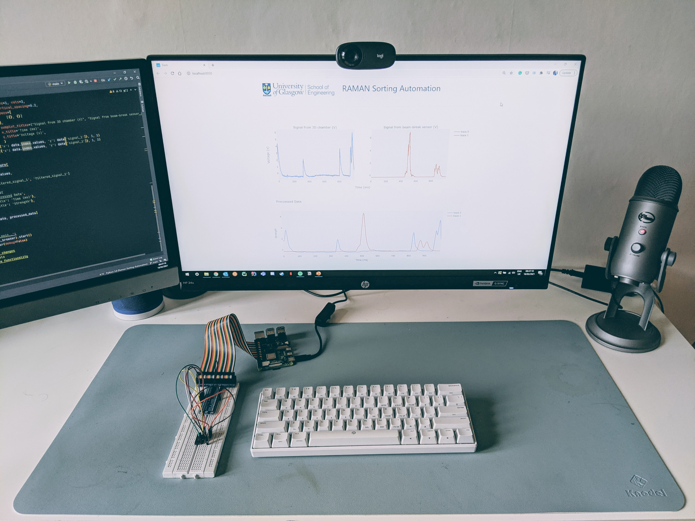

# Raman Sorting Automation using Raspberry Pi(4)


## Description

The goal of this project is to have a control system for the Raman Sorting Proecess.

Solarized dark             |  Solarized Ocean
:-------------------------:|:-------------------------:
  |  

## Getting Started

### Dependencies

* Python Libraries
* ex. Windows 10

### Installing

* How/where to download your program
* Any modifications needed to be made to files/folders

### Executing program

* How to run the program
* Step-by-step bullets
```
code blocks for commands
```

## Help

Any advise for common problems or issues.
```
command to run if program contains helper info
```

## Authors

Contributors names and contact info

ex. Dominique Pizzie  
ex. [@DomPizzie](https://twitter.com/dompizzie)
  

## Acknowledgments

Inspiration, code snippets, etc.
* [TowardsDataScience](https://towardsdatascience.com/)
* [awesome-readme](https://github.com/matiassingers/awesome-readme)
